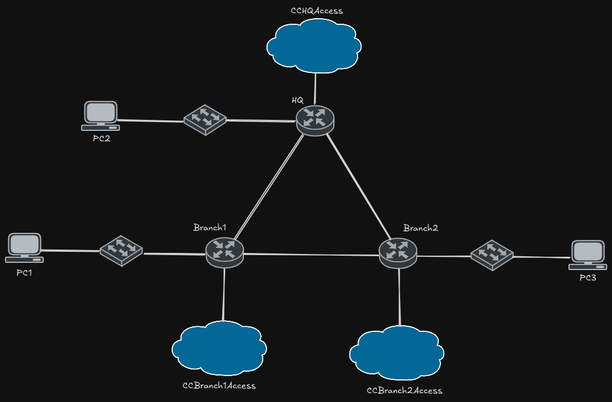

# LLMnetopsLab — Evaluating LLM Agents on Network Troubleshooting

Master's research project studying how well an autonomous LLM coding agent (Claude Code) can troubleshoot misconfigured networks. Each lab is a live GNS3 topology seeded with intentional faults. Claude Code is given SSH access to the devices and a prompt describing the intended design, then left to diagnose and repair the network unattended. Every run is captured (transcript + post-run config check) so fix rates, reasoning behaviour, tool usage and cost can be compared across runs and across lab difficulty.

The project has two lab versions of increasing complexity:

| | **v1** | **v2** (work in progress) |
|---|---|---|
| Origin | VyOS translation of Cisco Packet Tracer Activity 11.6.3 (CCNA OSPF troubleshooting) | Original design |
| Devices | 3 routers, 3 hosts | 9 routers, 10 hosts (19 devices) |
| Platforms | VyOS, VPCS | VyOS, MikroTik RouterOS 7, Alpine Linux |
| Routing | Single-area OSPF, default route from HQ | Multi-area OSPF (areas 0/10/20), ABRs, virtual link, inter-area summarization, ASBR with dual ISPs, NAT, floating static backup |
| Faults | 6 known faults (3 on HQ, 3 on Branch2) | Multiple faults, not disclosed to the agent ("may be anywhere in the lab") |
| Status | Complete — 50 runs captured and analyzed | Topology, base configs and prompt done; fault injection, verification and analysis in progress |

## Repository Layout

```
v1/                          # Single-area OSPF lab (CCNA 11.6.3 translation)
├── claude-prompt/CLAUDE.md  # Prompt given to Claude Code
├── configs/
│   ├── VyOS/{broken,corrected,CCAccess}/
│   ├── cisco/{broken,corrected}/   # Original IOS scripts for comparison
│   └── vpcs/
├── gns3/                    # Wiring guide + topology diagram
├── scripts/                 # push / verify / parse tooling
├── notebooks/               # Result visualizations
└── results/                 # 50 runs: verify JSON + Claude Code transcripts
v2/                          # Multi-area, multi-vendor OSPF WAN lab
├── claude-prompt/CLAUDE.md  # Prompt given to Claude Code
├── configs/
│   ├── VyOS/                # HQ-Edge, Hub-A, Hub-B, ISP-A, ISP-B (+ CCAccess/)
│   ├── Mikrotik/            # Branch-1 … Branch-4 (+ CCAccess/)
│   └── Alpine/              # 10 host scripts (+ CCAccess/)
├── gns3/                    # Wiring guide + topology diagram
└── scripts/connect_devices.py  # SSH reachability check for all 19 devices
```

---

## v1 — Single-Area OSPF (CCNA 11.6.3, VyOS Edition)

A VyOS translation of the Cisco IOS OSPF troubleshooting lab (Packet Tracer Activity 11.6.3), built in GNS3 with VyOS (`vyos-2026.02.12-0026-rolling-generic-amd64`) and VPCS. Three routers (HQ, Branch1, Branch2) run OSPF but contain **6 intentional errors**. Full wiring details are in [`v1/gns3/topology-notes.md`](v1/gns3/topology-notes.md).

### Topology



```
        [PC2]                 [PC1]                 [PC3]
          |                     |                     |
       HQ eth0           Branch1 eth0           Branch2 eth0
    10.10.0.1/22        10.10.4.1/23           10.10.6.1/23
          |                     |                     |
         HQ ---eth1---eth1--- Branch1               Branch2
          |   172.16.7.0/30     |   172.16.7.8/30     |
          +-----eth2-----------+----------eth1--------+
              172.16.7.4/30          (via Branch2 eth2)
```

### Errors (answer key)

| Router | Error | Broken Value | Correct Value |
|--------|-------|-------------|---------------|
| HQ | Wrong IP on eth0 | 10.10.10.1/22 | 10.10.0.1/22 |
| HQ | Missing default-information originate | (absent) | `set protocols ospf default-information originate` |
| HQ | Wrong OSPF network prefix | 10.10.0.0/21 | 10.10.0.0/22 |
| Branch2 | eth2 disabled | `disable` present | Remove `disable` |
| Branch2 | Wrong passive-interface | eth2 | eth0 |
| Branch2 | Wrong OSPF LAN network | 10.10.4.0/22 | 10.10.6.0/23 |

### Interface Mapping (Cisco → VyOS)

| Cisco | VyOS | Role |
|-------|------|------|
| FastEthernet0/0 | eth0 | LAN |
| Serial0/0/0 | eth1 | WAN link 1 |
| Serial0/0/1 | eth2 | WAN link 2 |
| Loopback1 | lo | Simulated ISP (HQ only) |

### Quick Start

Run the scripts from inside `v1/` — they resolve `configs/` and `results/` relative to it.

1. Import VyOS and VPCS nodes into GNS3 and wire them per `v1/gns3/topology-notes.md`.
2. Apply `configs/VyOS/CCAccess/*.set` so each router is reachable over SSH on eth3 (192.168.122.0/24).
3. Load the broken configs: `python scripts/push_configs.py broken` (or paste `configs/VyOS/broken/*.set`). Use `corrected` to load the answer key.
4. Load `configs/vpcs/*.vpc` onto each VPCS node.
5. Start Claude Code with `claude-prompt/CLAUDE.md` as its prompt.

### Verification and Analysis

```bash
cd v1

# Compare live router configs to the answer key (auto-numbers results/verify/run_NNN.json)
python scripts/verify_configs.py
python scripts/verify_configs.py --run-number 5   # explicit run number
python scripts/verify_configs.py --no-file        # stdout only

# Aggregate verify results into fix-rate / per-error / per-router stats
python scripts/parse_results.py results/verify/

# Parse Claude Code transcripts for duration, token cost, tool usage and behavioural metrics
# (including whether agent-written Python scripts were used for diagnosis, fixing or verification)
python scripts/parse_transcripts.py results/cctranscripts/
```

Both parsers accept `--format json|table` and `--output <path>`.

To inspect a single run:

```bash
python results/cctranscripts/extract_bash.py results/cctranscripts/r037.jsonl --filter ospf
python results/cctranscripts/extract_messages.py results/cctranscripts/r037.jsonl   # --with-thinking for thinking blocks
```

### Results and Visualization

`results/` holds all 50 captured runs (`verify/run_001.json … run_050.json`, `cctranscripts/r001.jsonl … r050.jsonl`). Plots are generated in `notebooks/visualize_results.ipynb`:

```bash
pip install -r requirements-viz.txt
jupyter notebook notebooks/visualize_results.ipynb
```

---

## v2 — Multi-Area, Multi-Vendor OSPF WAN (work in progress)

v2 scales the experiment up to a realistic small-enterprise WAN to test whether the agent's performance holds when the problem is larger, spans multiple vendors' CLIs, and requires reasoning about multi-area OSPF behaviour rather than a single flat area. Unlike v1, the agent is not told how many faults exist or where they are. Full addressing and wiring are in [`v2/gns3/topology-notes.md`](v2/gns3/topology-notes.md).

### Topology


```
     ISP-A  lo 8.8.8.8                       ISP-B  lo 1.1.1.1
          \  203.0.113.0/30                 /  203.0.113.4/30
            +---------- HQ-Edge ----------+           ASBR, NAT to both ISPs
                           |  172.16.1.0/30                            area 0
                         Hub-A                        ABR 0/10
           +---------------+----------------+
     172.16.10.0/30   172.16.10.4/30   172.16.10.8/30                  area 10
           |               |                |
       Branch-1        Branch-2         Branch-3
      10.1.1.0/24     10.1.2.0/24      10.1.3.0/24
                                            |  172.16.20.0/30          area 10
                                          Hub-B                       ABR 10/20
                                            |  172.16.20.4/30          area 20
                                        Branch-4
                                10.2.1.0/24    10.2.2.0/24

        Hub-A <====== virtual link through area 10 ======> Hub-B
```

### Design

- **Area 0:** HQ-Edge ↔ Hub-A. HQ-Edge is the ASBR and originates the default route.
- **Area 10:** Hub-A ↔ Branch-1/2/3, plus Branch-3 ↔ Hub-B. Hub-A is an ABR.
- **Area 20:** Hub-B ↔ Branch-4. Hub-B is an ABR.
- **Virtual link:** Area 20 has no physical path to area 0, so Hub-A and Hub-B form a virtual link across transit area 10.
- **Summarization:** ABRs summarize area 10 LANs as 10.1.0.0/16 and area 20 LANs as 10.2.0.0/16.
- **Internet:** default via ISP-A with ISP-B as a floating backup (distance 10); traffic is masqueraded out both uplinks. ISP loopbacks (8.8.8.8, 1.1.1.1) serve as test targets.
- **Management:** every device has an out-of-band interface on 192.168.122.0/24 (configs in each platform's `CCAccess/` folder) that is never part of OSPF.

### Current Status

- [x] Topology, addressing and OSPF design
- [x] Working base configs for VyOS, MikroTik and Alpine
- [x] Out-of-band SSH access for all 19 devices (`v2/scripts/connect_devices.py`)
- [x] Claude Code prompt (`v2/claude-prompt/CLAUDE.md`)
- [ ] Fault set and broken configs
- [ ] Config push / verification / analysis scripts for multi-vendor devices
- [ ] Experimental runs and comparison with v1

---

## Requirements

- **GNS3** 2.2+
- **VyOS** 2026.02 rolling (qcow2)
- **VPCS** (built into GNS3) — v1
- **MikroTik RouterOS 7** and **Alpine Linux** — v2
- **Python** 3.10+ with `netmiko`
- **Claude Code**
- **Optional (v1 visualization):** `pip install -r v1/requirements-viz.txt` (`matplotlib`, `seaborn`, `pandas`, `jupyter`)
