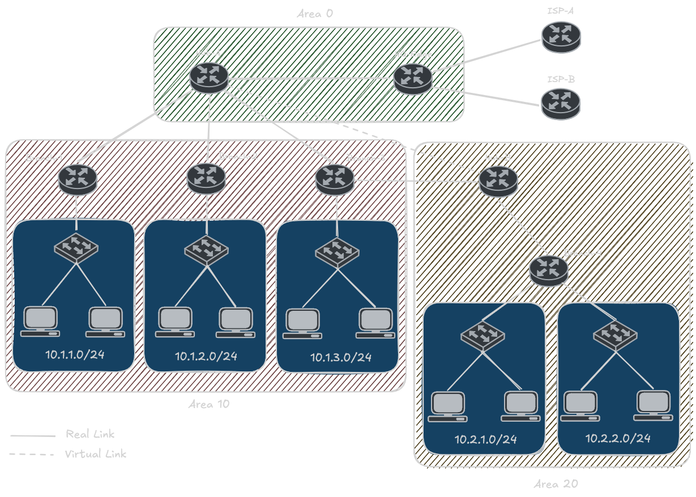

# GNS3 Topology Setup

## Required Images

| Device | GNS3 Node Type | Image |
|--------|----------------|-------|
| HQ-Edge, Hub-A, Hub-B, ISP-A, ISP-B | VyOS | vyos-2026.02.12-0026-rolling-generic-amd64 (qcow2) |
| Branch-1, Branch-2, Branch-3, Branch-4 | Mikrotik RouterOS | RouterOS 7.4... |
| B1-PC1/2, B2-PC1/2, B3-PC1/2, B4-PC1-4 | Alpine Linux | Alpine... |

## Wiring Diagram

## Cable Connections

| # | Side A | Side B | Subnet |
|---|--------|--------|--------|
| 1 | HQ-Edge eth0 | Hub-A eth0 | 172.16.1.0/30 |
| 2 | HQ-Edge eth1 | ISP-A eth0 | 203.0.113.0/30 |
| 3 | HQ-Edge eth2 | ISP-B eth0 | 203.0.113.4/30 |
| 4 | Hub-A eth1 | Branch-1 ether1 | 172.16.10.0/30 |
| 5 | Hub-A eth2 | Branch-2 ether1 | 172.16.10.4/30 |
| 6 | Hub-A eth3 | Branch-3 ether1 | 172.16.10.8/30 |
| 7 | Branch-1 ether2 | Switch1 e0 | 10.1.1.0/24 |
| 8 | Branch-2 ether2 | Switch2 e0 | 10.1.2.0/24 |
| 9 | Branch-3 ether2 | Switch3 e0 | 10.1.3.0/24 |
| 10 | Branch-3 ether3 | Hub-B eth0 | 172.16.20.0/30 |
| 11 | Hub-B eth1 | Branch-4 ether1 | 172.16.20.4/30 |
| 12 | Branch-4 ether2 | Switch4 e0 | 10.2.1.0/24 |
| 13 | Branch-4 ether3 | Switch5 e0 | 10.2.2.0/24 |

## Addressing

| Device | Interface | Address | Router ID |
|--------|-----------|---------|-----------|
| HQ-Edge | eth0 / eth1 / eth2 | 172.16.1.1 / 203.0.113.2 / 203.0.113.6 | 10.255.0.1 |
| Hub-A | eth0 / eth1 / eth2 / eth3 | 172.16.1.2 / 172.16.10.1 / .5 / .9 | 10.255.0.2 |
| Hub-B | eth0 / eth1 | 172.16.20.1 / 172.16.20.5 | 10.255.0.3 |
| ISP-A | eth0 / lo | 203.0.113.1 / 8.8.8.8 | - |
| ISP-B | eth0 / lo | 203.0.113.5 / 1.1.1.1 | - |
| Branch-1 | ether1 / ether2 | 172.16.10.2 / 10.1.1.1 | 10.255.1.1 |
| Branch-2 | ether1 / ether2 | 172.16.10.6 / 10.1.2.1 | 10.255.1.2 |
| Branch-3 | ether1 / ether2 / ether3 | 172.16.10.10 / 10.1.3.1 / 172.16.20.2 | 10.255.1.3 |
| Branch-4 | ether1 / ether2 / ether3 | 172.16.20.6 / 10.2.1.1 / 10.2.2.1 | 10.255.2.1 |

LAN gateways are `.1`; hosts use `.10` and up.

## OSPF Design

- **Area 0:** HQ-Edge eth0 and Hub-A eth0 (172.16.1.0/30). HQ-Edge is the ASBR and originates the default route.
- **Area 10:** Hub-A eth1-3, Branch-1/2/3, and the Branch-3 to Hub-B link (172.16.20.0/30). Hub-A is an ABR.
- **Area 20:** Hub-B eth1 and Branch-4. Hub-B is an ABR. Area 20 is totally stubby (`area-type stub no-summary` on Hub-B, `type=stub` on Branch-4), so Branch-4 gets only intra-area routes plus a default from Hub-B.
- **Authentication:** Area 0 uses MD5 (key ID 1) on the HQ-Edge to Hub-A link and on the virtual link. Hub-B needs `area 0 authentication md5` even though it has no area 0 networks: on VyOS the virtual-link `authentication md5` option only sets the key, and the auth type comes from the area 0 setting.
- **Virtual link:** Area 20 has no physical link to area 0, so Hub-A (10.255.0.2) and Hub-B (10.255.0.3) form a virtual link across transit area 10. Area 10 must stay a normal area (not stub/NSSA).
- **Summarization:** ABRs summarize area 10 LANs as 10.1.0.0/16 and area 20 LANs as 10.2.0.0/16.
- **Internet:** HQ-Edge (AS 65000) runs eBGP with ISP-A (AS 65100) and ISP-B (AS 65200). Each ISP sends a default route plus its loopback (8.8.8.8/32, 1.1.1.1/32). Local preference 200 on ISP-A routes makes ISP-A primary; HQ-Edge advertises nothing back (DENY-ALL export). Traffic is masqueraded out both ISP links. The ISP loopbacks are test targets, and 1.1.1.1 always goes via ISP-B, which exercises the backup path.
- **Guest LAN:** 10.2.2.0/24 on Branch-4 is internet-only. Branch-4's forward-chain filter drops guest traffic to 10.0.0.0/8 and new connections from 10.0.0.0/8 into the guest LAN.

## Enabling Claude Code Access (CCAccess)

Every router and PC has an extra interface connected to a GNS3 Cloud for out-of-band management over 192.168.122.0/24. The `CCAccess/` folder under each platform's configs sets the management address and enables SSH. Hostnames come from the normal configs. The management interface has no gateway and is not in OSPF, so it never carries lab traffic.

| Device | Interface | Address |
|--------|-----------|---------|
| HQ-Edge | eth3 | 192.168.122.11/24 |
| Hub-A | eth4 | 192.168.122.12/24 |
| Hub-B | eth3 | 192.168.122.13/24 |
| ISP-A | eth3 | 192.168.122.14/24 |
| ISP-B | eth3 | 192.168.122.15/24 |
| Branch-1 ... Branch-4 | ether4 | 192.168.122.21 ... .24/24 |
| B1-PC1, B1-PC2 | eth3 | 192.168.122.31, .32/24 |
| B2-PC1, B2-PC2 | eth3 | 192.168.122.33, .34/24 |
| B3-PC1, B3-PC2 | eth3 | 192.168.122.35, .36/24 |
| B4-PC1 ... B4-PC4 | eth3 | 192.168.122.37 ... .40/24 |

To apply:
- **VyOS:** `configure`, paste `configs/VyOS/CCAccess/<router>-access.set`, then `commit` and `save`.
- **MikroTik:** paste `configs/Mikrotik/CCAccess/<router>-access.rsc` into the terminal. It also removes the DHCP client that the CHR default config puts on ether1, which would otherwise install a distance-1 default route if anything answered it.
- **Alpine:** paste `configs/Alpine/<pc>.sh` first, then `configs/Alpine/CCAccess/<pc>-access.sh`. The base script rewrites `/etc/network/interfaces`, so re-running it removes eth3 until the access script is run again. SSH logs in as root, so set a root password with `passwd` first. If `openssh` isn't installed, the script runs `apk add openssh`, which needs internet access.

Credentials: VyOS `vyos` / `vyos`, MikroTik `admin` (password set at first login), Alpine `root` (password set with `passwd`).
